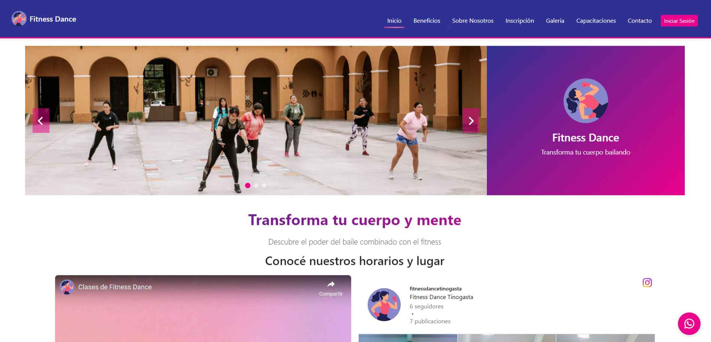
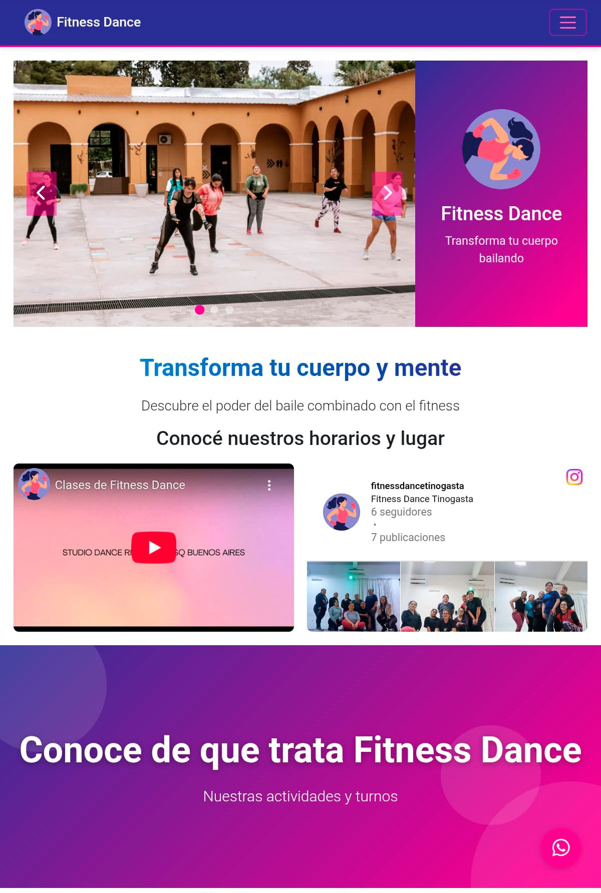
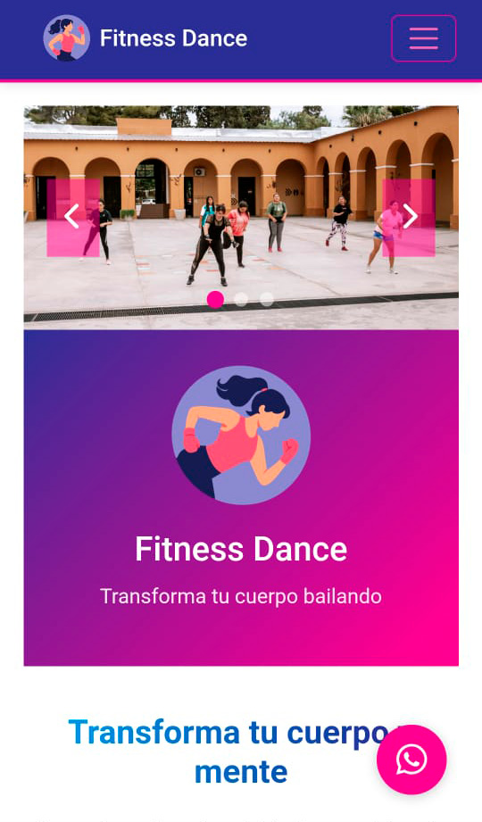

# 💃 FitnessDance by CamilaDifferent 🕺

✨ Sitio web para clases de fitness dance, una emocionante modalidad que combina:
- 🎵 Aeróbicos con ritmo
- 🥊 Aerobox strong (alto impacto)
- 💃 Aerodance (baile energético)
- 💪 Ejercicios de fuerza funcional

## 🌟 Características Principales
- 🖥️ Diseño responsive para todos los dispositivos
- 🎨 Interfaz moderna y atractiva
- 📅 Programación de clases intuitiva
- 📱 Fácil acceso desde móviles

## 🛠️ Tecnologías Utilizadas
| Frontend       | Descripción                          |
|----------------|--------------------------------------|
| HTML5          | Estructura semántica del sitio       |
| CSS3           | Estilos y animaciones modernas       |
| JavaScript ES6 | Interactividad y dinamismo           |

## 📸 Capturas de Pantalla

  

    
    
    
  

   Vistas del sitio FitnessDance - Diseño responsivo (PC, Tablet y Mobile)

## 👩‍💻 Creadora
**CamilaDifferent** 
